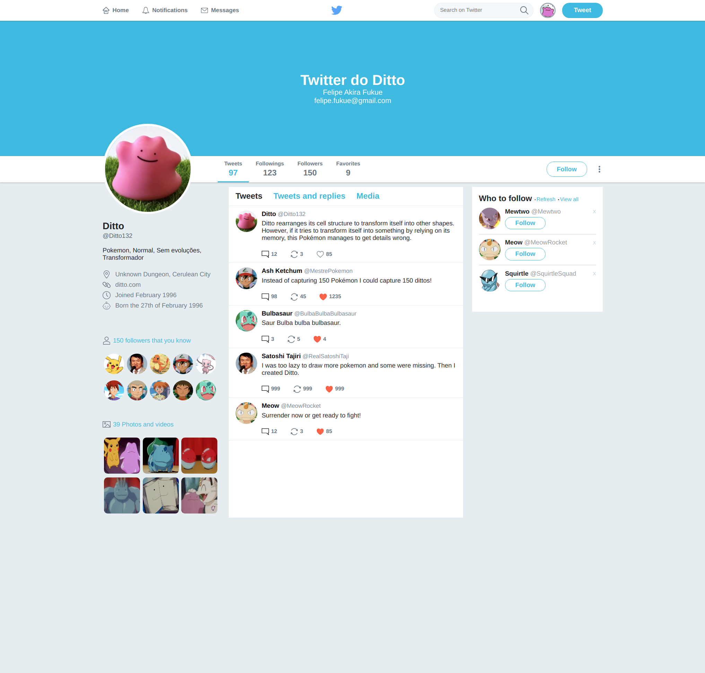

# Cópia do twitter

Projeto apenas com o **HTML** e o **CSS**. A intenção do projeto é simplesmente treinar e entender o conceito de flexbox usado dentro do CSS.

Para ficar um pouco mais divertido usei o tema pokemon, com o Ditto. Se procurar encontrará muitos "easter eggs" e muita nostalgia rs.

### Projeto concluido

